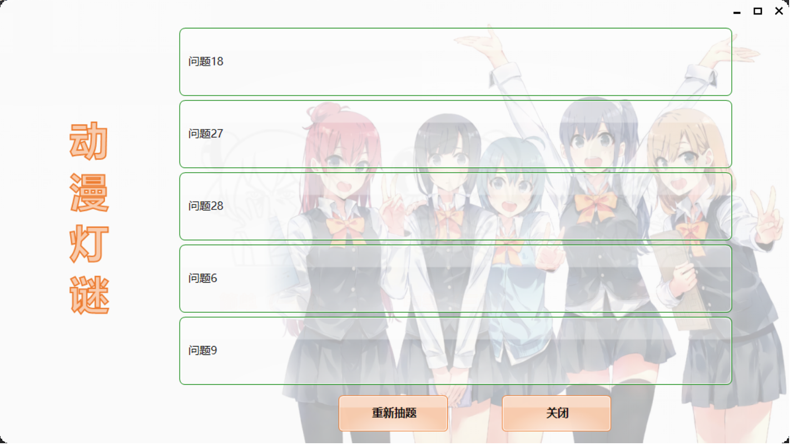

# ProblemExtractor
通过Excel读取题目，并进行抽题，使用Winform

在`exe`同目录放置excel文件，并且一列一个问题即可

* 界面库使用[DSkin](http://d.cskin.net/)
* Excel读取使用[ExcelDataReader](https://github.com/ExcelDataReader/ExcelDataReader)

## 截图

* 主界面

* 抽题界面

